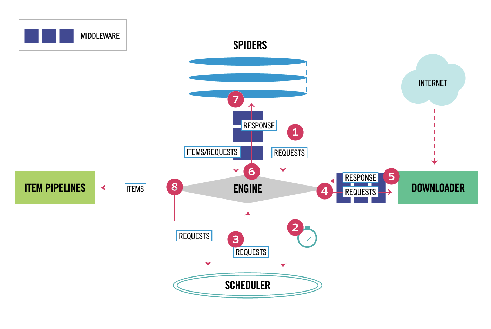

Scrapy的组件
我们先来说说 Scrapy 中的组件。

1. Scrapy 引擎（Engine）：用来控制整个系统的数据处理流程。
2. 调度器（Scheduler）：调度器从引擎接受请求并排序列入队列，并在引擎发出请求后返还给它们。
3. 下载器（Downloader）：下载器的主要职责是抓取网页并将网页内容返还给蜘蛛（Spiders）。
4. 蜘蛛程序（Spiders）：蜘蛛是用户自定义的用来解析网页并抓取特定URL的类，每个蜘蛛都能处理一个域名或一组域名，
简单的说就是用来定义特定网站的抓取和解析规则的模块。
5. 数据管道（Item Pipeline）：管道的主要责任是负责处理有蜘蛛从网页中抽取的数据条目，它的主要任务是清理、验证和存储数据。
当页面被蜘蛛解析后，将被发送到数据管道，并经过几个特定的次序处理数据。每个数据管道组件都是一个 Python 类，
它们获取了数据条目并执行对数据条目进行处理的方法，同时还需要确定是否需要在数据管道中继续执行下一步或是直接丢弃掉不处理。
数据管道通常执行的任务有：清理 HTML 数据、验证解析到的数据（检查条目是否包含必要的字段）、检查是不是重复数据（如果重复就丢弃）、
将解析到的数据存储到数据库（关系型数据库或 NoSQL 数据库）中。
6. 中间件（Middlewares）：中间件是介于引擎和其他组件之间的一个钩子框架，主要是为了提供自定义的代码来拓展 Scrapy 的功能，包括下载器中间件和蜘蛛中间件。

数据处理流程
Scrapy 的整个数据处理流程由引擎进行控制，通常的运转流程包括以下的步骤：

1. 引擎询问蜘蛛需要处理哪个网站，并让蜘蛛将第一个需要处理的 URL 交给它。

2. 引擎让调度器将需要处理的 URL 放在队列中。

3. 引擎从调度那获取接下来进行爬取的页面。

4. 调度将下一个爬取的 URL 返回给引擎，引擎将它通过下载中间件发送到下载器。

5. 当网页被下载器下载完成以后，响应内容通过下载中间件被发送到引擎；如果下载失败了，引擎会通知调度器记录这个 URL，待会再重新下载。

6. 引擎收到下载器的响应并将它通过蜘蛛中间件发送到蜘蛛进行处理。

7. 蜘蛛处理响应并返回爬取到的数据条目，此外还要将需要跟进的新的 URL 发送给引擎。

8. 引擎将抓取到的数据条目送入数据管道，把新的 URL 发送给调度器放入队列中。

上述操作中的第2步到第8步会一直重复直到调度器中没有需要请求的 URL，爬虫就停止工作。